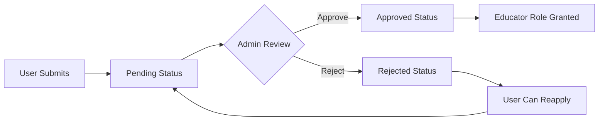

The Educator Applications interface allows administrators to review, approve, or reject applications from users who want to become course creators on the SkillRise platform.

## Overview

When users apply to become educators, their applications enter a review queue. Administrators can evaluate each application based on professional credentials, expertise, and background information before granting educator privileges.

<Info>
Approving an application automatically grants the user the "educator" role in Clerk, enabling them to create and publish courses
</Info>

## Application States

Applications progress through three possible states:

<Steps>
  <Step title="Pending">
    Newly submitted applications awaiting administrator review
  </Step>
  <Step title="Approved">
    Applications that have been accepted. User receives educator role and can create courses.
  </Step>
  <Step title="Rejected">
    Applications that were declined. User can resubmit with updated information.
  </Step>
</Steps>

## Filter System

Administrators can filter applications by status:

<Tabs>
  <Tab title="All">
    Displays all applications regardless of status
  </Tab>
  <Tab title="Pending">
    Shows applications awaiting review (default view)
  </Tab>
  <Tab title="Approved">
    Lists all approved educator applications
  </Tab>
  <Tab title="Rejected">
    Shows declined applications with rejection reasons
  </Tab>
</Tabs>

### Dynamic Filtering

Filters are applied server-side:

```javascript
const filter = status ? { status } : {}
const applications = await EducatorApplication.find(filter)
  .sort({ createdAt: -1 })
```

## Application Information

Each application displays comprehensive applicant information:

### Summary View

<CardGroup cols={2}>
  <Card title="Professional Title" icon="briefcase">
    The applicant's professional designation (e.g., "Senior Software Engineer")
  </Card>
  <Card title="Expertise Areas" icon="tags">
    Comma-separated list of subject areas the applicant can teach
  </Card>
  <Card title="Status Badge" icon="circle-check">
    Color-coded indicator showing application state
  </Card>
  <Card title="Submission Date" icon="calendar">
    When the application was submitted (formatted as "15 Jan 2024")
  </Card>
</CardGroup>

### Expanded Details

Click the expand button to view full application details:

<Accordion title="Bio">
A detailed professional biography describing the applicant's background, teaching experience, and qualifications.
</Accordion>

<Accordion title="LinkedIn / Portfolio URL">
Optional link to the applicant's LinkedIn profile or personal portfolio website for verification.
</Accordion>

<Accordion title="User ID">
Clerk user identifier for account lookup and verification.
</Accordion>

<Accordion title="Rejection Reason" icon="circle-xmark">
For rejected applications, displays the reason provided by the reviewing administrator.
</Accordion>

## Application Actions

### Approve Application

<Steps>
  <Step title="Click Approve">
    Click the teal "Approve" button on a pending application
  </Step>
  <Step title="Status Update">
    Application status changes to "approved" in the database
  </Step>
  <Step title="Role Grant">
    Clerk user metadata is updated with `role: 'educator'`
  </Step>
  <Step title="User Notification">
    User can now access educator features and create courses
  </Step>
</Steps>

**Backend Process**:
```javascript
// Update application status
application.status = 'approved'
application.rejectionReason = ''
await application.save()

// Grant educator role via Clerk
await clerkClient.users.updateUserMetadata(application.userId, {
  publicMetadata: { role: 'educator' }
})
```

### Reject Application

<Steps>
  <Step title="Click Reject">
    Click the red "Reject" button on a pending application
  </Step>
  <Step title="Provide Reason">
    A modal appears requesting an optional rejection reason
  </Step>
  <Step title="Confirm Rejection">
    Click "Confirm Reject" to finalize the decision
  </Step>
  <Step title="Status Update">
    Application is marked as rejected with the provided reason
  </Step>
</Steps>

**Rejection Modal**:

<Frame>
  <div style={{padding: '20px', background: '#f9fafb', borderRadius: '8px'}}>
    <strong>Reject Application</strong>
    <p style={{fontSize: '14px', color: '#6b7280', marginTop: '8px'}}>
      Optionally provide a reason. The applicant will see this when they check their status.
    </p>
    <textarea 
      placeholder="Rejection reason (optional)…"
      style={{width: '100%', marginTop: '12px', padding: '10px', border: '1px solid #d1d5db', borderRadius: '6px'}}
    />
  </div>
</Frame>

<Note>
Providing a detailed rejection reason helps applicants understand what improvements are needed if they choose to reapply
</Note>

## API Endpoints

### GET /api/admin/educator-applications

Fetches applications with optional status filtering:

**Request**:
```http
GET /api/admin/educator-applications?status=pending
Authorization: Bearer <admin_token>
```

**Response**:
```json
{
  "success": true,
  "applications": [
    {
      "_id": "app123",
      "userId": "user_2abc123def456",
      "professionalTitle": "Senior Software Engineer",
      "bio": "10+ years of experience in web development...",
      "expertise": ["React", "Node.js", "TypeScript"],
      "linkedinUrl": "https://linkedin.com/in/johndoe",
      "status": "pending",
      "rejectionReason": "",
      "createdAt": "2024-03-15T10:30:00Z"
    }
  ]
}
```

### PATCH /api/admin/educator-applications/:id/approve

Approves an application and grants educator role:

**Request**:
```http
PATCH /api/admin/educator-applications/app123/approve
Authorization: Bearer <admin_token>
```

**Response**:
```json
{
  "success": true,
  "message": "Application approved. Educator role granted."
}
```

### PATCH /api/admin/educator-applications/:id/reject

Rejects an application with optional reason:

**Request**:
```http
PATCH /api/admin/educator-applications/app123/reject
Authorization: Bearer <admin_token>
Content-Type: application/json

{
  "reason": "Please provide more detail about your teaching experience."
}
```

**Response**:
```json
{
  "success": true,
  "message": "Application rejected."
}
```

<Warning>
All endpoints require admin authentication via Bearer token
</Warning>

## Application Lifecycle

### New Application



### Reapplication Process

Users with rejected applications can reapply:

<Steps>
  <Step title="Rejected Application">
    Application status is set to "rejected" with a reason
  </Step>
  <Step title="User Reviews Feedback">
    User sees rejection reason in their application status
  </Step>
  <Step title="Update & Resubmit">
    User updates their information and resubmits
  </Step>
  <Step title="Status Reset">
    Application status changes back to "pending" for review
  </Step>
</Steps>

**Backend Logic**:
```javascript
if (existing && existing.status === 'rejected') {
  existing.professionalTitle = professionalTitle
  existing.bio = bio
  existing.expertise = expertise
  existing.status = 'pending'
  existing.rejectionReason = ''
  await existing.save()
}
```

## Data Model

The EducatorApplication schema:

| Field | Type | Required | Description |
|-------|------|----------|-------------|
| `userId` | String | Yes | Unique Clerk user identifier |
| `professionalTitle` | String | Yes | Applicant's professional designation |
| `bio` | String | Yes | Detailed professional background |
| `expertise` | Array | Yes | List of subject areas (min 1) |
| `linkedinUrl` | String | No | LinkedIn or portfolio URL |
| `status` | String | Yes | One of: pending, approved, rejected |
| `rejectionReason` | String | No | Admin-provided rejection explanation |
| `createdAt` | Date | Auto | Application submission timestamp |

## Best Practices

<AccordionGroup>
  <Accordion title="Review Timeline">
    Aim to review pending applications within 24-48 hours to maintain a positive user experience and encourage quality educators to join the platform.
  </Accordion>
  <Accordion title="Rejection Reasons">
    Always provide constructive feedback when rejecting applications. This helps applicants improve their submissions and encourages reapplication.
  </Accordion>
  <Accordion title="Verification">
    Review LinkedIn profiles or portfolio URLs when provided to verify credentials and professional background.
  </Accordion>
  <Accordion title="Expertise Evaluation">
    Ensure the applicant's expertise areas align with platform content needs and existing course gaps.
  </Accordion>
</AccordionGroup>

## Status Indicators

Each status has distinct visual styling:

<CardGroup cols={3}>
  <Card title="Pending" color="#f59e0b">
    Amber badge indicating awaiting review
  </Card>
  <Card title="Approved" color="#14b8a6">
    Teal badge indicating acceptance
  </Card>
  <Card title="Rejected" color="#ef4444">
    Red badge indicating declined status
  </Card>
</CardGroup>

## Responsive Design

The application list adapts to different screen sizes:

- **Mobile**: Stacked layout with essential information visible
- **Tablet**: Expanded cards with action buttons
- **Desktop**: Full details with inline actions and expanded views

## Loading States

While processing actions:
- Approve button shows "…" and is disabled
- Reject modal shows "Rejecting…" during submission
- All other buttons are disabled to prevent concurrent actions

<Tip>
Regularly check the pending applications count on the main dashboard. A high backlog may indicate the need for additional reviewers or streamlined criteria.
</Tip>