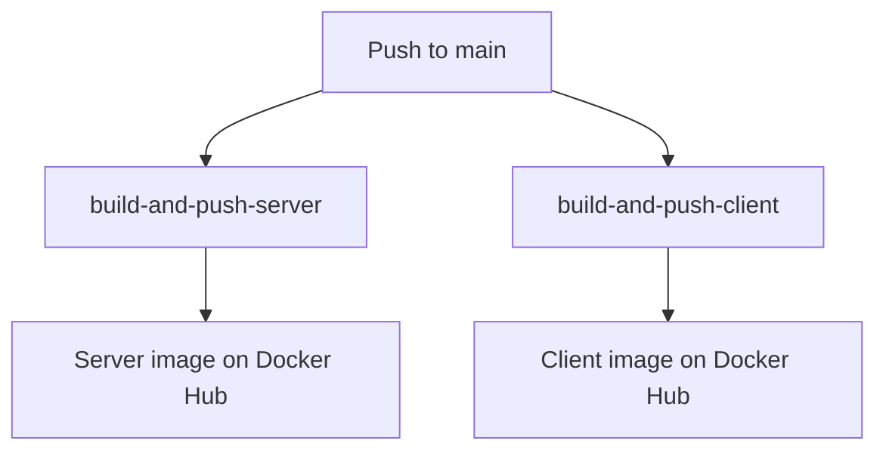

## Overview

SkillRise uses GitHub Actions for continuous integration and deployment. The pipeline consists of two workflows:

<CardGroup cols={2}>
  <Card title="Build Workflow" icon="hammer">
    Runs on pull requests to validate code quality
  </Card>
  <Card title="Deploy Workflow" icon="rocket">
    Builds and pushes Docker images on main branch
  </Card>
</CardGroup>

## Build Workflow

The build workflow runs on every pull request to ensure code quality before merging.

### Configuration

```yaml .github/workflows/build.yml
name: CI pipeline to Lint, Format & Build Client and Lint & Format Server

on:
    pull_request:
        branches:
            - main
            - dev

jobs:
    client:
        name: Lint, Format & Build Client
        runs-on: ubuntu-latest
        defaults:
            run:
                working-directory: client

        steps:
            - uses: actions/checkout@v3

            - name: Use Node.js
              uses: actions/setup-node@v3
              with:
                  node-version: '20'

            - name: Install Dependencies
              run: npm ci

            - name: Run ESLint
              run: npm run lint

            - name: Check Prettier Formatting
              run: npm run format:check

            - name: Run Build
              run: npm run build
              env:
                  VITE_CLERK_PUBLISHABLE_KEY: ${{ secrets.VITE_CLERK_PUBLISHABLE_KEY }}
                  VITE_STRIPE_PUBLISHABLE_KEY: ${{ secrets.VITE_STRIPE_PUBLISHABLE_KEY }}
                  VITE_BACKEND_URL: ${{ secrets.VITE_BACKEND_URL }}

    server:
        name: Lint & Format Check Server
        runs-on: ubuntu-latest
        defaults:
            run:
                working-directory: server

        steps:
            - uses: actions/checkout@v3

            - name: Use Node.js
              uses: actions/setup-node@v3
              with:
                  node-version: '20'

            - name: Install Dependencies
              run: npm ci

            - name: Run ESLint
              run: npm run lint

            - name: Check Prettier Formatting
              run: npm run format:check
```

### Workflow Stages

<Steps>
  <Step title="Client Validation">
    The client job validates the React frontend:

    <AccordionGroup>
      <Accordion title="Dependency Installation">
        ```bash
        npm ci
        ```
        Uses `npm ci` for clean, reproducible installs based on `package-lock.json`.
      </Accordion>

      <Accordion title="ESLint">
        ```bash
        npm run lint
        ```
        Checks for code quality issues, potential bugs, and style violations.

        **Configuration:** `eslint.config.js`
        - React hooks rules
        - React refresh plugin
        - Prettier integration
      </Accordion>

      <Accordion title="Prettier">
        ```bash
        npm run format:check
        ```
        Verifies consistent code formatting without modifying files.

        **Configuration:** `.prettierrc`
        - 2-space indentation
        - Single quotes
        - Semicolons
        - Trailing commas
      </Accordion>

      <Accordion title="Build">
        ```bash
        npm run build
        ```
        Compiles the React app with Vite to ensure no build errors.

        **Build-time environment variables:**
        - `VITE_CLERK_PUBLISHABLE_KEY`
        - `VITE_STRIPE_PUBLISHABLE_KEY`
        - `VITE_BACKEND_URL`

        These are read from GitHub Secrets and embedded in the build.
      </Accordion>
    </AccordionGroup>
  </Step>

  <Step title="Server Validation">
    The server job validates the Node.js backend:

    <AccordionGroup>
      <Accordion title="Dependency Installation">
        ```bash
        npm ci
        ```
        Installs all dependencies including devDependencies for linting.
      </Accordion>

      <Accordion title="ESLint">
        ```bash
        npm run lint
        ```
        Checks Express server code for issues.

        **Configuration:** `eslint.config.js`
        - Node.js globals
        - ES2022 syntax
        - Prettier integration
      </Accordion>

      <Accordion title="Prettier">
        ```bash
        npm run format:check
        ```
        Ensures consistent formatting across all server files.
      </Accordion>
    </AccordionGroup>
  </Step>
</Steps>

### Running Locally

You can run the same checks locally before pushing:

<CodeGroup>
```bash Client
cd client
npm ci
npm run lint
npm run format:check
npm run build
```

```bash Server
cd server
npm ci
npm run lint
npm run format:check
```
</CodeGroup>

<Tip>
  Use `npm run lint:fix` and `npm run format` to automatically fix issues.
</Tip>

## Deploy Workflow

The deploy workflow automatically builds and pushes Docker images when code is merged to the main branch.

### Configuration

```yaml .github/workflows/deploy.yml
name: Build and Deploy to Docker Hub

on:
    push:
        branches:
            - main

jobs:
    build-and-push-server:
        name: Build & Push Server Image
        runs-on: ubuntu-latest

        steps:
            - name: Check Out Repo
              uses: actions/checkout@v4

            - name: Log in to Docker Hub
              uses: docker/login-action@v3
              with:
                  username: ${{ secrets.DOCKER_USERNAME }}
                  password: ${{ secrets.DOCKER_PASSWORD }}

            - name: Build and Push Server Image
              uses: docker/build-push-action@v5
              with:
                  context: ./server
                  file: ./server/Dockerfile
                  push: true
                  tags: pushkarverma/skillrise-server:latest

    build-and-push-client:
        name: Build & Push Client Image
        runs-on: ubuntu-latest

        steps:
            - name: Check Out Repo
              uses: actions/checkout@v4

            - name: Log in to Docker Hub
              uses: docker/login-action@v3
              with:
                  username: ${{ secrets.DOCKER_USERNAME }}
                  password: ${{ secrets.DOCKER_PASSWORD }}

            - name: Build and Push Client Image
              uses: docker/build-push-action@v5
              with:
                  context: ./client
                  file: ./client/Dockerfile
                  push: true
                  tags: pushkarverma/skillrise-client:latest
                  build-args: |
                      VITE_CLERK_PUBLISHABLE_KEY=${{ secrets.VITE_CLERK_PUBLISHABLE_KEY }}
                      VITE_STRIPE_PUBLISHABLE_KEY=${{ secrets.VITE_STRIPE_PUBLISHABLE_KEY }}
                      VITE_BACKEND_URL=${{ secrets.VITE_BACKEND_URL }}
```

### Workflow Stages

<Steps>
  <Step title="Server Image Build">
    The `build-and-push-server` job creates the backend Docker image:

    <AccordionGroup>
      <Accordion title="Checkout Code">
        ```yaml
        - name: Check Out Repo
          uses: actions/checkout@v4
        ```
        Clones the repository with full git history.
      </Accordion>

      <Accordion title="Docker Hub Login">
        ```yaml
        - name: Log in to Docker Hub
          uses: docker/login-action@v3
          with:
              username: ${{ secrets.DOCKER_USERNAME }}
              password: ${{ secrets.DOCKER_PASSWORD }}
        ```
        Authenticates with Docker Hub using repository secrets.
      </Accordion>

      <Accordion title="Build and Push">
        ```yaml
        - name: Build and Push Server Image
          uses: docker/build-push-action@v5
          with:
              context: ./server
              file: ./server/Dockerfile
              push: true
              tags: pushkarverma/skillrise-server:latest
        ```
        
        **Process:**
        1. Builds image from `server/Dockerfile`
        2. Tags as `pushkarverma/skillrise-server:latest`
        3. Pushes to Docker Hub
        4. Replaces previous `latest` tag

        **Image size:** ~150MB  
        **Build time:** ~2-3 minutes
      </Accordion>
    </AccordionGroup>
  </Step>

  <Step title="Client Image Build">
    The `build-and-push-client` job creates the frontend Docker image:

    <AccordionGroup>
      <Accordion title="Checkout and Login">
        Same as server: checks out code and authenticates with Docker Hub.
      </Accordion>

      <Accordion title="Build and Push with Arguments">
        ```yaml
        - name: Build and Push Client Image
          uses: docker/build-push-action@v5
          with:
              context: ./client
              file: ./client/Dockerfile
              push: true
              tags: pushkarverma/skillrise-client:latest
              build-args: |
                  VITE_CLERK_PUBLISHABLE_KEY=${{ secrets.VITE_CLERK_PUBLISHABLE_KEY }}
                  VITE_STRIPE_PUBLISHABLE_KEY=${{ secrets.VITE_STRIPE_PUBLISHABLE_KEY }}
                  VITE_BACKEND_URL=${{ secrets.VITE_BACKEND_URL }}
        ```

        **Build arguments:**
        - `VITE_CLERK_PUBLISHABLE_KEY` - Embedded in build for authentication
        - `VITE_STRIPE_PUBLISHABLE_KEY` - Embedded in build for payments
        - `VITE_BACKEND_URL` - API endpoint URL

        **Multi-stage build:**
        1. Stage 1: Compiles React app with Vite
        2. Stage 2: Copies build to Nginx image

        **Image size:** ~25MB  
        **Build time:** ~3-4 minutes
      </Accordion>
    </AccordionGroup>
  </Step>
</Steps>

### Job Execution

<Info>
  Both jobs run in **parallel** for faster deployment. They are independent and don't wait for each other.
</Info>



## Required Secrets

Configure these secrets in your GitHub repository settings:

<AccordionGroup>
  <Accordion title="Docker Hub Credentials">
    **`DOCKER_USERNAME`**  
    Your Docker Hub username

    **`DOCKER_PASSWORD`**  
    Docker Hub access token (recommended) or password

    <Warning>
      Use an access token instead of your password for better security. Generate one at [Docker Hub Security Settings](https://hub.docker.com/settings/security).
    </Warning>
  </Accordion>

  <Accordion title="Client Build Variables">
    **`VITE_CLERK_PUBLISHABLE_KEY`**  
    Clerk publishable key for authentication  
    Example: `pk_test_...` or `pk_live_...`

    **`VITE_STRIPE_PUBLISHABLE_KEY`**  
    Stripe publishable key for payments  
    Example: `pk_test_...` or `pk_live_...`

    **`VITE_BACKEND_URL`**  
    Backend API URL  
    Example: `https://api.yourdomain.com` or `http://localhost:3000`

    <Tip>
      These are **public** keys safe to embed in the client bundle. Never add secret keys here.
    </Tip>
  </Accordion>
</AccordionGroup>

### Adding Secrets

<Steps>
  <Step title="Navigate to Repository Settings">
    Go to your GitHub repository → **Settings** → **Secrets and variables** → **Actions**
  </Step>

  <Step title="Add New Secret">
    Click **New repository secret**
  </Step>

  <Step title="Enter Secret Details">
    - **Name:** Use exact names from the list above (case-sensitive)
    - **Value:** Paste the secret value
    - Click **Add secret**
  </Step>

  <Step title="Verify">
    Secrets should appear in the list but values remain hidden
  </Step>
</Steps>

## Triggering Deployments

### Automatic Deployment

Deployment triggers automatically when:

```bash
git push origin main
```

Or when you merge a pull request to `main`:

```bash
gh pr merge 123 --merge
```

### Manual Deployment

To trigger manually without code changes:

<Steps>
  <Step title="Go to Actions Tab">
    Navigate to **Actions** in your GitHub repository
  </Step>

  <Step title="Select Deploy Workflow">
    Click on **Build and Deploy to Docker Hub**
  </Step>

  <Step title="Run Workflow">
    Click **Run workflow** → Select `main` branch → **Run workflow**
  </Step>
</Steps>

## Monitoring Workflow Runs

### View Run Status

1. Go to the **Actions** tab in your repository
2. Click on a workflow run to see details
3. Expand jobs to view step-by-step logs

### Status Indicators

<CardGroup cols={3}>
  <Card title="Success" icon="check" color="#10b981">
    All jobs completed successfully
  </Card>
  <Card title="In Progress" icon="spinner" color="#f59e0b">
    Workflow is currently running
  </Card>
  <Card title="Failed" icon="xmark" color="#ef4444">
    One or more jobs failed
  </Card>
</CardGroup>

### Common Failure Reasons

<AccordionGroup>
  <Accordion title="Build Workflow Failures">
    **ESLint errors:**
    ```
    Error: Process completed with exit code 1.
    ```
    Fix: Run `npm run lint:fix` locally and commit fixes

    **Prettier errors:**
    ```
    Code style issues found in the above file(s).
    ```
    Fix: Run `npm run format` locally and commit changes

    **Build errors:**
    ```
    Error: Process completed with exit code 1.
    ```
    Fix: Run `npm run build` locally to identify the issue
  </Accordion>

  <Accordion title="Deploy Workflow Failures">
    **Docker login failed:**
    ```
    Error: Unable to locate credentials
    ```
    Fix: Verify `DOCKER_USERNAME` and `DOCKER_PASSWORD` secrets

    **Build context error:**
    ```
    Error: failed to solve: failed to read dockerfile
    ```
    Fix: Ensure Dockerfile exists in the correct directory

    **Push failed:**
    ```
    Error: denied: requested access to the resource is denied
    ```
    Fix: Check Docker Hub repository permissions and credentials

    **Build args missing:**
    ```
    Error: missing value for build arg
    ```
    Fix: Verify all client build secrets are configured
  </Accordion>
</AccordionGroup>

## Workflow Optimization

### Caching Dependencies

Add caching to speed up builds:

```yaml
- name: Use Node.js
  uses: actions/setup-node@v3
  with:
      node-version: '20'
      cache: 'npm'
      cache-dependency-path: '**/package-lock.json'
```

### Docker Layer Caching

Enable BuildKit cache:

```yaml
- name: Build and Push Server Image
  uses: docker/build-push-action@v5
  with:
      context: ./server
      file: ./server/Dockerfile
      push: true
      tags: pushkarverma/skillrise-server:latest
      cache-from: type=registry,ref=pushkarverma/skillrise-server:latest
      cache-to: type=inline
```

### Matrix Builds

Test multiple Node versions:

```yaml
jobs:
    test:
        runs-on: ubuntu-latest
        strategy:
            matrix:
                node-version: [18, 20, 22]
        steps:
            - uses: actions/checkout@v3
            - name: Use Node.js ${{ matrix.node-version }}
              uses: actions/setup-node@v3
              with:
                  node-version: ${{ matrix.node-version }}
```

## Advanced Workflows

### Environment-Specific Deployments

Deploy to staging and production:

```yaml
name: Deploy to Environments

on:
    push:
        branches:
            - main
            - staging

jobs:
    deploy:
        runs-on: ubuntu-latest
        steps:
            - uses: actions/checkout@v4
            
            - name: Set environment
              run: |
                  if [[ "${{ github.ref }}" == "refs/heads/main" ]]; then
                      echo "ENV=production" >> $GITHUB_ENV
                      echo "TAG=latest" >> $GITHUB_ENV
                  else
                      echo "ENV=staging" >> $GITHUB_ENV
                      echo "TAG=staging" >> $GITHUB_ENV
                  fi
            
            - name: Build and Push
              uses: docker/build-push-action@v5
              with:
                  context: ./server
                  push: true
                  tags: pushkarverma/skillrise-server:${{ env.TAG }}
```

### Slack Notifications

Send deployment status to Slack:

```yaml
- name: Notify Slack
  if: always()
  uses: 8398a7/action-slack@v3
  with:
      status: ${{ job.status }}
      text: 'Deployment ${{ job.status }}'
      webhook_url: ${{ secrets.SLACK_WEBHOOK }}
```

### Automated Rollbacks

Revert to previous image on failure:

```yaml
- name: Health Check
  run: |
      curl --fail http://localhost:3000/ || exit 1

- name: Rollback on Failure
  if: failure()
  run: |
      docker pull pushkarverma/skillrise-server:previous
      docker tag pushkarverma/skillrise-server:previous pushkarverma/skillrise-server:latest
      docker push pushkarverma/skillrise-server:latest
```

## Best Practices

<CardGroup cols={2}>
  <Card title="Version Tagging" icon="tag">
    Use semantic versioning alongside `latest`:
    ```yaml
    tags: |
      pushkarverma/skillrise-server:latest
      pushkarverma/skillrise-server:v1.2.3
      pushkarverma/skillrise-server:v1.2
      pushkarverma/skillrise-server:v1
    ```
  </Card>

  <Card title="Branch Protection" icon="shield">
    Require CI checks to pass before merging:
    - Go to **Settings** → **Branches**
    - Add rule for `main`
    - Enable "Require status checks"
    - Select CI jobs
  </Card>

  <Card title="Secrets Rotation" icon="key">
    Regularly rotate credentials:
    - Docker Hub tokens every 90 days
    - API keys when team members leave
    - Use different keys for staging/production
  </Card>

  <Card title="Monitoring" icon="chart-line">
    Track deployment metrics:
    - Build duration trends
    - Image size changes
    - Deployment frequency
    - Failure rates
  </Card>
</CardGroup>

## Next Steps

<CardGroup cols={2}>
  <Card title="Docker Deployment" icon="docker" href="/deployment/docker">
    Deploy with Docker Compose
  </Card>
  <Card title="Environment Variables" icon="key" href="/deployment/environment-variables">
    Configure application settings
  </Card>
</CardGroup>