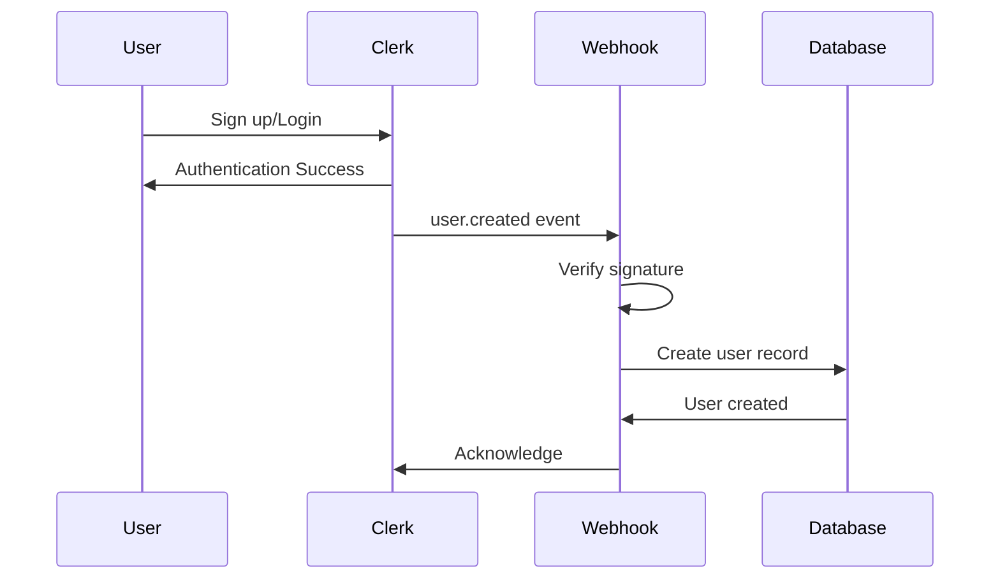

## Overview

SkillRise uses **Clerk** for authentication, providing secure user management with OAuth providers, magic links, and email/password authentication. The system implements role-based access control (RBAC) with three distinct user roles.

## User Roles

SkillRise implements three role levels through Clerk's session claims:

<CardGroup cols={3}>
  <Card title="Student" icon="graduation-cap">
    Default role for all new users. Access to courses, quizzes, community, and analytics.
  </Card>
  <Card title="Educator" icon="chalkboard-user">
    Create and manage courses, view enrollment data, and access quiz insights.
  </Card>
  <Card title="Admin" icon="user-shield">
    Full platform access including educator application review and system management.
  </Card>
</CardGroup>

## Clerk Integration

### User Model Schema

The User model syncs with Clerk through webhooks:

```javascript server/models/User.js
import mongoose from 'mongoose'

const userSchema = new mongoose.Schema(
  {
    _id: { type: String, required: true }, // Clerk user ID
    name: { type: String, required: true },
    email: { type: String, required: true },
    imageUrl: { type: String, required: true },
    enrolledCourses: [{
      type: mongoose.Schema.Types.ObjectId,
      ref: 'Course',
    }],
  },
  { timestamps: true }
)

const User = mongoose.model('User', userSchema)
export default User
```

<Note>
  The `_id` field uses Clerk's user ID as the primary key, ensuring seamless synchronization between Clerk and the application database.
</Note>

## Webhook Handlers

### Clerk Webhook Events

SkillRise listens to three Clerk webhook events to keep user data synchronized:

```javascript server/controllers/webhooks.js
import { Webhook } from 'svix'
import User from '../models/User.js'

export const clerkWebhooks = async (req, res) => {
  try {
    const webhook = new Webhook(process.env.CLERK_WEBHOOK_SECRET)

    // Verify webhook signature
    await webhook.verify(JSON.stringify(req.body), {
      'svix-id': req.headers['svix-id'],
      'svix-timestamp': req.headers['svix-timestamp'],
      'svix-signature': req.headers['svix-signature'],
    })

    const { data, type } = req.body

    switch (type) {
      case 'user.created': {
        const userData = {
          _id: data.id,
          email: data.email_addresses[0].email_address,
          name: data.first_name + ' ' + data.last_name,
          imageUrl: data.image_url,
        }
        await User.create(userData)
        res.json({})
        break
      }

      case 'user.updated': {
        const userData = {
          email: data.email_addresses[0].email_address,
          name: data.first_name + ' ' + data.last_name,
          imageUrl: data.image_url,
        }
        await User.findByIdAndUpdate(data.id, userData)
        res.json({})
        break
      }

      case 'user.deleted': {
        await User.findByIdAndDelete(data.id)
        res.json({})
        break
      }

      default:
        res.json({})
    }
  } catch (error) {
    console.error(error)
    res.status(500).json({ 
      success: false, 
      message: 'An unexpected error occurred' 
    })
  }
}
```

<Steps>
  <Step title="Signature Verification">
    Svix library verifies the webhook signature using headers to ensure authenticity.
  </Step>
  <Step title="Event Handling">
    Switch statement handles create, update, and delete events from Clerk.
  </Step>
  <Step title="Database Sync">
    User data is immediately synchronized with the MongoDB database.
  </Step>
</Steps>

## Role-Based Middleware

### Educator Protection

Middleware to protect educator-only routes:

```javascript server/middlewares/authMiddleware.js
export const protectEducator = (req, res, next) => {
  try {
    if (!req.auth?.userId) {
      return res.status(401).json({ 
        success: false, 
        message: 'Unauthorized Access' 
      })
    }

    const role = req.auth.sessionClaims?.metadata?.role

    if (role !== 'educator') {
      return res.status(403).json({ 
        success: false, 
        message: 'Unauthorized Access' 
      })
    }

    next()
  } catch (error) {
    res.status(500).json({ 
      success: false, 
      message: 'Internal Server Error' 
    })
  }
}
```

### Admin Protection

Middleware to protect admin-only routes:

```javascript server/middlewares/authMiddleware.js
export const protectAdmin = (req, res, next) => {
  try {
    if (!req.auth?.userId) {
      return res.status(401).json({ 
        success: false, 
        message: 'Unauthorized Access' 
      })
    }

    const role = req.auth.sessionClaims?.metadata?.role

    if (role !== 'admin') {
      return res.status(403).json({ 
        success: false, 
        message: 'Unauthorized Access' 
      })
    }

    next()
  } catch (error) {
    res.status(500).json({ 
      success: false, 
      message: 'Internal Server Error' 
    })
  }
}
```

<Tip>
  Role information is stored in Clerk's session claims under `metadata.role`, allowing for flexible role assignment without database queries.
</Tip>

## Environment Variables

Required environment variables for authentication:

```bash .env
CLERK_WEBHOOK_SECRET=whsec_xxxxxxxxxxxxx
CLERK_PUBLISHABLE_KEY=pk_test_xxxxxxxxxxxxx
CLERK_SECRET_KEY=sk_test_xxxxxxxxxxxxx
```

## Security Features

<AccordionGroup>
  <Accordion title="Webhook Signature Verification">
    All Clerk webhooks are verified using Svix signatures to prevent unauthorized requests and ensure data integrity.
  </Accordion>
  
  <Accordion title="Session-Based Authorization">
    User roles are checked on every protected request through session claims, ensuring real-time access control.
  </Accordion>
  
  <Accordion title="Automatic Synchronization">
    User data is automatically synchronized between Clerk and the database, eliminating manual updates and reducing inconsistencies.
  </Accordion>
  
  <Accordion title="ID as Primary Key">
    Using Clerk's user ID as the primary key prevents ID conflicts and simplifies relationship management across the system.
  </Accordion>
</AccordionGroup>

## Authentication Flow



## Best Practices

<CardGroup cols={2}>
  <Card title="Always Verify Signatures" icon="signature">
    Never process webhook events without signature verification to prevent security vulnerabilities.
  </Card>
  <Card title="Use Session Claims" icon="key">
    Store role information in session claims for real-time authorization without database queries.
  </Card>
  <Card title="Idempotent Operations" icon="rotate">
    Design webhook handlers to handle duplicate events gracefully.
  </Card>
  <Card title="Error Logging" icon="bug">
    Log all authentication errors for debugging and security monitoring.
  </Card>
</CardGroup>

## Next Steps

<CardGroup cols={2}>
  <Card title="Course Management" icon="book" href="/features/course-management">
    Learn how educators create and manage courses
  </Card>
  <Card title="Payment System" icon="credit-card" href="/features/payment-system">
    Understand the enrollment and payment flow
  </Card>
</CardGroup>