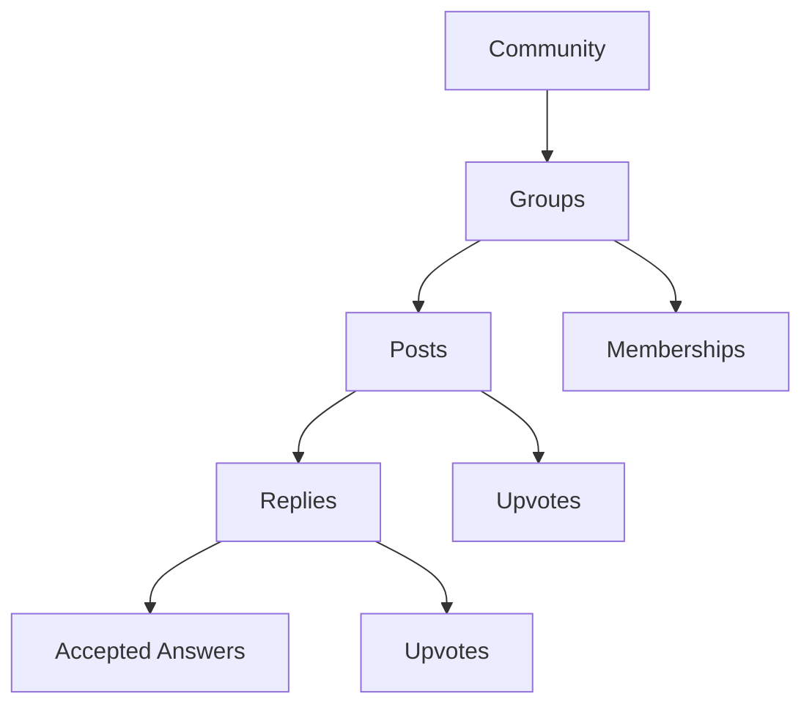

## Overview

SkillRise's community platform enables peer-to-peer learning through **groups**, **posts**, and **replies**. Students can ask questions, share knowledge, and build connections with fellow learners.

## Community Architecture



## Data Models

### Group Schema

```javascript server/models/Group.js
import mongoose from 'mongoose'

const groupSchema = new mongoose.Schema(
  {
    name: { type: String, required: true },
    slug: { 
      type: String, 
      required: true, 
      unique: true, 
      lowercase: true 
    },
    description: { type: String, default: '' },
    icon: { type: String, default: '💬' },
    memberCount: { type: Number, default: 0 },
    postCount: { type: Number, default: 0 },
    createdBy: { type: String, default: 'system' },
    isOfficial: { type: Boolean, default: false },
  },
  { timestamps: true }
)

const Group = mongoose.model('CommunityGroup', groupSchema)
export default Group
```

<Note>
  Groups use URL-friendly slugs generated from names, with automatic uniqueness checking.
</Note>

### Community Post Schema

```javascript server/models/CommunityPost.js
import mongoose from 'mongoose'

const communityPostSchema = new mongoose.Schema(
  {
    authorId: { type: String, required: true },
    authorName: { type: String, required: true },
    authorImage: { type: String, default: '' },
    groupId: { 
      type: mongoose.Schema.Types.ObjectId, 
      ref: 'CommunityGroup', 
      default: null 
    },
    title: { type: String, required: true },
    content: { type: String, required: true },
    tags: [{ type: String }],
    upvotes: [{ type: String }], // array of userIds
    replyCount: { type: Number, default: 0 },
    isResolved: { type: Boolean, default: false },
  },
  { timestamps: true }
)

communityPostSchema.index({ groupId: 1, createdAt: -1 })
communityPostSchema.index({ createdAt: -1 })

const CommunityPost = mongoose.model('CommunityPost', communityPostSchema)
export default CommunityPost
```

### Reply Schema

```javascript server/models/Reply.js
import mongoose from 'mongoose'

const replySchema = new mongoose.Schema(
  {
    postId: {
      type: mongoose.Schema.Types.ObjectId,
      ref: 'CommunityPost',
      required: true,
      index: true,
    },
    authorId: { type: String, required: true },
    authorName: { type: String, required: true },
    authorImage: { type: String, default: '' },
    content: { type: String, required: true },
    upvotes: [{ type: String }],
    isAcceptedAnswer: { type: Boolean, default: false },
  },
  { timestamps: true }
)

const Reply = mongoose.model('CommunityReply', replySchema)
export default Reply
```

<Info>
  Upvotes are stored as arrays of user IDs, allowing efficient membership checks and preventing duplicate votes.
</Info>

## Group Management

### List All Groups

```javascript server/controllers/communityController.js
export const getGroups = async (req, res) => {
  try {
    const userId = req.auth?.userId
    const groups = await Group.find()
      .sort({ isOfficial: -1, memberCount: -1 })
      .lean()

    let memberSet = new Set()
    if (userId) {
      const memberships = await GroupMembership.find({ userId })
        .select('groupId')
        .lean()
      memberSet = new Set(memberships.map((m) => m.groupId.toString()))
    }

    const result = groups.map(({ createdBy, ...g }) => ({
      ...g,
      isMember: memberSet.has(g._id.toString()),
    }))
    
    res.json({ success: true, groups: result })
  } catch (error) {
    console.error(error)
    res.status(500).json({ 
      success: false, 
      message: 'An unexpected error occurred' 
    })
  }
}
```

<Steps>
  <Step title="Fetch Groups">
    Retrieve all groups, sorting official groups first, then by member count.
  </Step>
  <Step title="Check Memberships">
    Query memberships for the authenticated user to determine joined status.
  </Step>
  <Step title="Enrich Response">
    Add `isMember` flag to each group for UI rendering.
  </Step>
</Steps>

### Create Group

```javascript server/controllers/communityController.js
export const createGroup = async (req, res) => {
  try {
    const userId = req.auth?.userId
    if (!userId) {
      return res.status(401).json({ 
        success: false, 
        message: 'Authentication required' 
      })
    }

    const { name, description, icon } = req.body
    if (!name?.trim()) {
      return res.json({ 
        success: false, 
        message: 'Group name is required' 
      })
    }

    // Generate slug from name
    const slug = name
      .trim()
      .toLowerCase()
      .replace(/[^a-z0-9]+/g, '-')
      .replace(/^-|-$/g, '')
      
    // Check for existing group with same slug or name
    const existing = await Group.findOne({
      $or: [
        { slug },
        {
          name: {
            $regex: new RegExp(
              `^${name.trim().replace(/[.*+?^${}()|[\]\\]/g, '\\$&')}$`, 
              'i'
            ),
          },
        },
      ],
    })
    
    if (existing) {
      return res.json({ 
        success: false, 
        message: 'A group with this name already exists' 
      })
    }

    const group = await Group.create({
      name: name.trim().slice(0, 60),
      slug,
      description: (description || '').trim().slice(0, 200),
      icon: icon || '💬',
      createdBy: userId,
    })
    
    // Auto-join creator
    await GroupMembership.create({ userId, groupId: group._id })
    const updated = await Group.findByIdAndUpdate(
      group._id,
      { $inc: { memberCount: 1 } },
      { new: true }
    ).lean()

    const { createdBy, ...groupData } = updated
    res.json({ 
      success: true, 
      group: { ...groupData, isMember: true } 
    })
  } catch (error) {
    console.error(error)
    res.status(500).json({ 
      success: false, 
      message: 'An unexpected error occurred' 
    })
  }
}
```

<Warning>
  Group names are validated for uniqueness (case-insensitive) and slugs are automatically generated to prevent URL conflicts.
</Warning>

### Toggle Membership

```javascript server/controllers/communityController.js
export const toggleMembership = async (req, res) => {
  try {
    const userId = req.auth?.userId
    if (!userId) {
      return res.status(401).json({ 
        success: false, 
        message: 'Authentication required' 
      })
    }

    const { groupId } = req.params
    const existing = await GroupMembership.findOne({ userId, groupId })

    if (existing) {
      // Leave group
      await GroupMembership.deleteOne({ userId, groupId })
      await Group.findByIdAndUpdate(groupId, { $inc: { memberCount: -1 } })
      res.json({ success: true, isMember: false })
    } else {
      // Join group
      await GroupMembership.create({ userId, groupId })
      await Group.findByIdAndUpdate(groupId, { $inc: { memberCount: 1 } })
      res.json({ success: true, isMember: true })
    }
  } catch (error) {
    console.error(error)
    res.status(500).json({ 
      success: false, 
      message: 'An unexpected error occurred' 
    })
  }
}
```

<Tip>
  Membership toggle is idempotent - calling it multiple times won't create duplicate memberships or incorrect counts.
</Tip>

## Post Management

### Create Post

```javascript server/controllers/communityController.js
export const createPost = async (req, res) => {
  try {
    const userId = req.auth?.userId
    if (!userId) {
      return res.status(401).json({ 
        success: false, 
        message: 'Authentication required' 
      })
    }

    const { title, content, groupId, tags } = req.body
    if (!title?.trim() || !content?.trim()) {
      return res.json({ 
        success: false, 
        message: 'Title and content are required' 
      })
    }

    const author = await User.findById(userId)
    if (!author) {
      return res.json({ 
        success: false, 
        message: 'User not found' 
      })
    }

    // Parse tags from array or comma-separated string
    const parsedTags = Array.isArray(tags)
      ? tags.map((tag) => tag.trim()).filter(Boolean).slice(0, 5)
      : typeof tags === 'string'
        ? tags.split(',').map((tag) => tag.trim()).filter(Boolean).slice(0, 5)
        : []

    const post = await CommunityPost.create({
      authorId: userId,
      authorName: author.name,
      authorImage: author.imageUrl || '',
      groupId: groupId || null,
      title: title.trim().slice(0, 200),
      content: content.trim().slice(0, 5000),
      tags: parsedTags,
    })

    if (groupId) {
      await Group.findByIdAndUpdate(groupId, { $inc: { postCount: 1 } })
    }

    const populated = await CommunityPost.findById(post._id)
      .populate('groupId', 'name slug icon')
      .lean()
      
    res.json({
      success: true,
      post: enrichPost({ ...populated, group: populated.groupId }, userId),
    })
  } catch (error) {
    console.error(error)
    res.status(500).json({ 
      success: false, 
      message: 'An unexpected error occurred' 
    })
  }
}
```

<Info>
  Posts can belong to a group or be posted globally (groupId: null). Tags are limited to 5 per post.
</Info>

### Get Posts with Filters

```javascript server/controllers/communityController.js
export const getPosts = async (req, res) => {
  try {
    const userId = req.auth?.userId
    const { groupId, tab = 'all', page = 1 } = req.query
    const LIMIT = 15
    const skip = (parseInt(page) - 1) * LIMIT

    // Build base query
    const query = {}
    if (groupId) {
      query.groupId = groupId
    } else if (tab === 'myGroups' && userId) {
      const memberships = await GroupMembership.find({ userId })
        .select('groupId')
        .lean()
      query.groupId = { $in: memberships.map((m) => m.groupId) }
    }

    let posts, total

    if (tab === 'trending') {
      // Sort by upvote count using aggregation
      const pipeline = [
        { $match: query },
        { $addFields: { upvoteCount: { $size: '$upvotes' } } },
        { $sort: { upvoteCount: -1, createdAt: -1 } },
        { $skip: skip },
        { $limit: LIMIT },
        {
          $lookup: {
            from: 'communitygroups',
            localField: 'groupId',
            foreignField: '_id',
            as: 'groupArr',
          },
        },
        { $addFields: { group: { $arrayElemAt: ['$groupArr', 0] } } },
        { $project: { groupArr: 0 } },
      ]
      posts = await CommunityPost.aggregate(pipeline)
      total = await CommunityPost.countDocuments(query)
    } else {
      // Default sort by most recent
      const raw = await CommunityPost.find(query)
        .sort({ createdAt: -1 })
        .skip(skip)
        .limit(LIMIT)
        .populate('groupId', 'name slug icon')
        .lean()
      posts = raw.map((p) => ({ ...p, group: p.groupId, groupId: undefined }))
      total = await CommunityPost.countDocuments(query)
    }

    const enriched = posts.map((p) => enrichPost(p, userId))
    res.json({ 
      success: true, 
      posts: enriched, 
      hasMore: skip + posts.length < total, 
      total 
    })
  } catch (error) {
    console.error(error)
    res.status(500).json({ 
      success: false, 
      message: 'An unexpected error occurred' 
    })
  }
}
```

<Steps>
  <Step title="Build Query">
    Filter by group, my groups, or all posts based on tab selection.
  </Step>
  <Step title="Sort Strategy">
    Use aggregation for trending (upvote count) or simple sort for recent posts.
  </Step>
  <Step title="Pagination">
    Implement limit/skip pagination with hasMore flag for infinite scroll.
  </Step>
  <Step title="Enrich Data">
    Add user-specific flags (isAuthor, isUpvoted) and hide sensitive data.
  </Step>
</Steps>

### Post Enrichment Helper

```javascript server/controllers/communityController.js
const enrichPost = (post, userId) => ({
  ...post,
  authorId: undefined,
  isAuthor: userId ? post.authorId === userId : false,
  group: post.groupId ?? post.group ?? null,
  groupId: undefined,
  upvoteCount: Array.isArray(post.upvotes) ? post.upvotes.length : 0,
  isUpvoted: userId 
    ? Array.isArray(post.upvotes) && post.upvotes.includes(userId) 
    : false,
  upvotes: undefined,
})
```

<Note>
  The enrichment helper strips the upvotes array and authorId for privacy while adding computed flags for UI rendering.
</Note>

## Reply System

### Create Reply

```javascript server/controllers/communityController.js
export const createReply = async (req, res) => {
  try {
    const userId = req.auth?.userId
    if (!userId) {
      return res.status(401).json({ 
        success: false, 
        message: 'Authentication required' 
      })
    }

    const { content } = req.body
    if (!content?.trim()) {
      return res.json({ 
        success: false, 
        message: 'Reply content is required' 
      })
    }

    const post = await CommunityPost.findById(req.params.postId)
    if (!post) {
      return res.json({ 
        success: false, 
        message: 'Post not found' 
      })
    }

    const author = await User.findById(userId)
    if (!author) {
      return res.json({ 
        success: false, 
        message: 'User not found' 
      })
    }

    const reply = await Reply.create({
      postId: post._id,
      authorId: userId,
      authorName: author.name,
      authorImage: author.imageUrl || '',
      content: content.trim().slice(0, 3000),
    })

    post.replyCount += 1
    await post.save()

    res.json({
      success: true,
      reply: {
        ...reply.toObject(),
        authorId: undefined,
        isAuthor: true,
        upvoteCount: 0,
        isUpvoted: false,
        upvotes: undefined,
      },
    })
  } catch (error) {
    console.error(error)
    res.status(500).json({ 
      success: false, 
      message: 'An unexpected error occurred' 
    })
  }
}
```

### Get Post with Replies

```javascript server/controllers/communityController.js
export const getPost = async (req, res) => {
  try {
    const userId = req.auth?.userId
    const post = await CommunityPost.findById(req.params.postId)
      .populate('groupId', 'name slug icon')
      .lean()
      
    if (!post) {
      return res.json({ 
        success: false, 
        message: 'Post not found' 
      })
    }

    // Replies: accepted answer first, then by creation time
    const rawReplies = await Reply.find({ postId: post._id })
      .sort({ isAcceptedAnswer: -1, createdAt: 1 })
      .lean()

    const replies = rawReplies.map((r) => ({
      ...r,
      authorId: undefined,
      isAuthor: userId ? r.authorId === userId : false,
      upvoteCount: r.upvotes.length,
      isUpvoted: userId ? r.upvotes.includes(userId) : false,
      upvotes: undefined,
    }))

    res.json({
      success: true,
      post: { 
        ...enrichPost({ ...post, group: post.groupId }, userId), 
        replies 
      },
    })
  } catch (error) {
    console.error(error)
    res.status(500).json({ 
      success: false, 
      message: 'An unexpected error occurred' 
    })
  }
}
```

<Info>
  Accepted answers always appear first in the reply list, followed by chronological order.
</Info>

## Upvoting System

### Toggle Post Upvote

```javascript server/controllers/communityController.js
export const togglePostUpvote = async (req, res) => {
  try {
    const userId = req.auth?.userId
    if (!userId) {
      return res.status(401).json({ 
        success: false, 
        message: 'Authentication required' 
      })
    }

    const post = await CommunityPost.findById(req.params.postId)
    if (!post) {
      return res.json({ 
        success: false, 
        message: 'Post not found' 
      })
    }

    const idx = post.upvotes.indexOf(userId)
    idx > -1 
      ? post.upvotes.splice(idx, 1) 
      : post.upvotes.push(userId)
    await post.save()

    res.json({ 
      success: true, 
      upvoteCount: post.upvotes.length, 
      isUpvoted: idx === -1 
    })
  } catch (error) {
    console.error(error)
    res.status(500).json({ 
      success: false, 
      message: 'An unexpected error occurred' 
    })
  }
}
```

### Toggle Reply Upvote

```javascript server/controllers/communityController.js
export const toggleReplyUpvote = async (req, res) => {
  try {
    const userId = req.auth?.userId
    if (!userId) {
      return res.status(401).json({ 
        success: false, 
        message: 'Authentication required' 
      })
    }

    const reply = await Reply.findById(req.params.replyId)
    if (!reply) {
      return res.json({ 
        success: false, 
        message: 'Reply not found' 
      })
    }

    const idx = reply.upvotes.indexOf(userId)
    idx > -1 
      ? reply.upvotes.splice(idx, 1) 
      : reply.upvotes.push(userId)
    await reply.save()

    res.json({ 
      success: true, 
      upvoteCount: reply.upvotes.length, 
      isUpvoted: idx === -1 
    })
  } catch (error) {
    console.error(error)
    res.status(500).json({ 
      success: false, 
      message: 'An unexpected error occurred' 
    })
  }
}
```

<Tip>
  Upvote arrays naturally prevent duplicates - attempting to upvote twice will remove the vote instead.
</Tip>

## Accepted Answers

### Accept Answer (Post Author Only)

```javascript server/controllers/communityController.js
export const acceptAnswer = async (req, res) => {
  try {
    const userId = req.auth?.userId
    if (!userId) {
      return res.status(401).json({ 
        success: false, 
        message: 'Authentication required' 
      })
    }

    const post = await CommunityPost.findById(req.params.postId)
    if (!post) {
      return res.json({ 
        success: false, 
        message: 'Post not found' 
      })
    }
    
    if (post.authorId !== userId) {
      return res.status(403).json({ 
        success: false, 
        message: 'Only the post author can accept an answer' 
      })
    }

    const reply = await Reply.findById(req.params.replyId)
    if (!reply) {
      return res.json({ 
        success: false, 
        message: 'Reply not found' 
      })
    }

    // Unaccept all answers first (only one accepted answer per post)
    await Reply.updateMany(
      { postId: post._id }, 
      { isAcceptedAnswer: false }
    )

    const nowAccepted = !reply.isAcceptedAnswer
    if (nowAccepted) {
      await Reply.findByIdAndUpdate(reply._id, { isAcceptedAnswer: true })
      post.isResolved = true
      await post.save()
    }

    res.json({ 
      success: true, 
      isAcceptedAnswer: nowAccepted, 
      postResolved: post.isResolved 
    })
  } catch (error) {
    console.error(error)
    res.status(500).json({ 
      success: false, 
      message: 'An unexpected error occurred' 
    })
  }
}
```

<Steps>
  <Step title="Authorization Check">
    Verify the requester is the post author.
  </Step>
  <Step title="Clear Previous Answers">
    Unaccept all other answers for the post.
  </Step>
  <Step title="Mark Answer">
    Set the selected reply as the accepted answer.
  </Step>
  <Step title="Resolve Post">
    Mark the post as resolved when an answer is accepted.
  </Step>
</Steps>

## Community Features

<CardGroup cols={2}>
  <Card title="Groups" icon="users-rectangle">
    Topic-based communities with membership tracking and post counts.
  </Card>
  <Card title="Posts" icon="file-lines">
    Questions and discussions with tags, upvotes, and resolved status.
  </Card>
  <Card title="Replies" icon="comments">
    Threaded responses with accepted answer functionality.
  </Card>
  <Card title="Upvoting" icon="arrow-up">
    Community-driven content ranking for posts and replies.
  </Card>
  <Card title="Tags" icon="tags">
    Topic classification with up to 5 tags per post.
  </Card>
  <Card title="Resolution" icon="check-circle">
    Question resolution system with accepted answers.
  </Card>
</CardGroup>

## Tabs and Filters

<AccordionGroup>
  <Accordion title="All Posts (Default)">
    Shows all posts across all groups, sorted by most recent.
  </Accordion>
  
  <Accordion title="Trending">
    Posts sorted by upvote count, then by creation date.
  </Accordion>
  
  <Accordion title="My Groups">
    Only shows posts from groups the user has joined.
  </Accordion>
  
  <Accordion title="Group Filter">
    Filter posts to a specific group using the groupId query parameter.
  </Accordion>
</AccordionGroup>

## Pagination

The community uses **limit/skip pagination** with 15 posts per page:

```javascript
const LIMIT = 15
const skip = (parseInt(page) - 1) * LIMIT
```

Response includes `hasMore` flag for infinite scroll:

```javascript
hasMore: skip + posts.length < total
```

## Best Practices

<CardGroup cols={2}>
  <Card title="Privacy Protection" icon="shield">
    Strip upvote arrays and author IDs from responses to protect user privacy.
  </Card>
  <Card title="Denormalized Counts" icon="hashtag">
    Store memberCount, postCount, and replyCount for efficient queries.
  </Card>
  <Card title="Composite Indexes" icon="magnifying-glass">
    Use compound indexes on groupId + createdAt for optimal query performance.
  </Card>
  <Card title="Author-Only Actions" icon="user-lock">
    Verify ownership before allowing delete, edit, or accept answer operations.
  </Card>
</CardGroup>

## Content Limits

<Info>
  - Group names: 60 characters
  - Group descriptions: 200 characters
  - Post titles: 200 characters
  - Post content: 5,000 characters
  - Reply content: 3,000 characters
  - Tags per post: 5
</Info>

## Next Steps

<CardGroup cols={3}>
  <Card title="Authentication" icon="shield" href="/features/authentication">
    Understand user roles and access control
  </Card>
  <Card title="AI Features" icon="brain" href="/features/ai-features">
    Leverage AI for personalized learning assistance
  </Card>
  <Card title="Analytics" icon="chart-line" href="/features/analytics">
    Track engagement and learning patterns
  </Card>
</CardGroup>