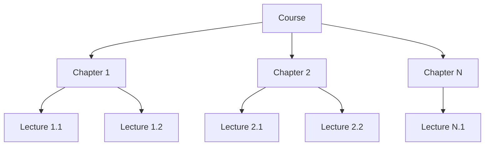

## Overview

SkillRise courses are structured hierarchically with **courses** containing **chapters**, and chapters containing **lectures**. The system automatically calculates course statistics and manages student enrollments.

## Course Structure

### Data Model

The Course schema implements a flexible nested structure:

```javascript server/models/Course.js
import mongoose from 'mongoose'

const lectureSchema = new mongoose.Schema(
  {
    lectureId: { type: String, required: true },
    lectureTitle: { type: String, required: true },
    lectureDuration: { type: Number, required: true },
    lectureUrl: { type: String, required: true },
    isPreviewFree: { type: Boolean, required: true },
    lectureOrder: { type: Number, required: true },
  },
  { _id: false }
)

const chapterSchema = new mongoose.Schema(
  {
    chapterId: { type: String, required: true },
    chapterOrder: { type: Number, required: true },
    chapterTitle: { type: String, required: true },
    chapterContent: [lectureSchema],
  },
  { _id: false }
)

const courseSchema = new mongoose.Schema(
  {
    courseTitle: { type: String, required: true },
    courseDescription: { type: String, required: true },
    courseThumbnail: { type: String },
    coursePrice: { type: Number, required: true },
    isPublished: { type: Boolean, default: true },
    discount: { type: Number, required: true, min: 0, max: 100 },

    courseContent: [chapterSchema],

    courseRatings: [{ 
      userId: { type: String }, 
      rating: { type: Number, min: 1, max: 5 } 
    }],

    averageRating: { type: Number, default: 0 },
    totalRatings: { type: Number, default: 0 },

    totalLectures: { type: Number, default: 0 },
    totalDurationMinutes: { type: Number, default: 0 },

    educatorId: { type: String, ref: 'User', required: true },

    enrolledStudents: [{ type: String, ref: 'User' }],
    totalEnrolledStudents: { type: Number, default: 0 },
  },
  { timestamps: true, minimize: false }
)

courseSchema.index({ educatorId: 1 })

const Course = mongoose.model('Course', courseSchema)
export default Course
```

<Note>
  The nested structure (Course → Chapter → Lecture) is stored as embedded documents for efficient querying and atomic updates.
</Note>

## Course Hierarchy



## Creating Courses

### Add New Course

Educators can create courses with automatic statistic calculation:

```javascript server/controllers/educatorController.js
export const addCourse = async (req, res) => {
  try {
    const { courseData } = req.body
    const imageFile = req.file
    const educatorId = req.auth.userId

    if (!imageFile) {
      return res.json({
        success: false,
        message: 'Thumbnail Not Attached',
      })
    }

    const { 
      courseTitle, 
      courseDescription, 
      coursePrice, 
      discount, 
      courseContent, 
      isPublished 
    } = JSON.parse(courseData)

    // Calculate total lectures and total duration
    let totalLectures = 0
    let totalDurationMinutes = 0

    courseContent.forEach((chapter) => {
      if (Array.isArray(chapter.chapterContent)) {
        totalLectures += chapter.chapterContent.length

        chapter.chapterContent.forEach((lecture) => {
          totalDurationMinutes += lecture.lectureDuration
        })
      }
    })

    const newCourse = await Course.create({
      courseTitle,
      courseDescription,
      coursePrice,
      discount,
      courseContent,
      isPublished,
      educatorId,
      totalLectures,
      totalDurationMinutes,
    })

    // Upload thumbnail to Cloudinary
    const imageUpload = await cloudinary.uploader.upload(imageFile.path)
    newCourse.courseThumbnail = imageUpload.secure_url
    await newCourse.save()

    res.json({
      success: true,
      message: 'Course Added Successfully',
    })
  } catch (error) {
    console.error(error)
    res.status(500).json({
      success: false,
      message: 'An unexpected error occurred',
    })
  }
}
```

<Steps>
  <Step title="Upload Validation">
    Verify that a thumbnail image has been uploaded before processing.
  </Step>
  <Step title="Statistics Calculation">
    Automatically calculate total lectures and duration by traversing the course content hierarchy.
  </Step>
  <Step title="Database Creation">
    Create the course document with all calculated metadata.
  </Step>
  <Step title="Image Upload">
    Upload thumbnail to Cloudinary and store the secure URL.
  </Step>
</Steps>

## Retrieving Courses

### Get All Published Courses

Public endpoint for browsing courses:

```javascript server/controllers/courseController.js
export const getAllCourse = async (req, res) => {
  try {
    const courses = await Course.find({ isPublished: true })
      .select(['-courseContent', '-courseRatings', '-enrolledStudents'])
      .populate({ path: 'educatorId', select: 'name imageUrl' })

    const safeCourses = courses.map((course) => {
      const obj = course.toObject()
      return obj
    })

    res.json({
      success: true,
      courses: safeCourses,
    })
  } catch (error) {
    console.error(error)
    res.status(500).json({
      success: false,
      message: 'An unexpected error occurred',
    })
  }
}
```

### Get Course Details with Access Control

Retrieve course details with conditional lecture URL access:

```javascript server/controllers/courseController.js
export const getCourseById = async (req, res) => {
  const { id } = req.params

  try {
    const courseData = await Course.findById(id)
      .select(['-courseRatings', '-enrolledStudents'])
      .populate({
        path: 'educatorId',
        select: 'name imageUrl',
      })

    if (!courseData) {
      return res.json({ 
        success: false, 
        message: 'Course not found' 
      })
    }

    // Hide lecture URLs for non-preview content
    courseData.courseContent.forEach((chapter) => {
      chapter.chapterContent.forEach((lecture) => {
        if (!lecture.isPreviewFree) {
          lecture.lectureUrl = ''
        }
      })
    })

    res.json({
      success: true,
      courseData,
    })
  } catch (error) {
    console.error(error)
    res.status(500).json({
      success: false,
      message: 'An unexpected error occurred',
    })
  }
}
```

<Warning>
  Lecture URLs are hidden for non-preview lectures to prevent unauthorized access to paid content.
</Warning>

## Progress Tracking

### Course Progress Model

```javascript server/models/CourseProgress.js
import mongoose from 'mongoose'

const courseProgressSchema = new mongoose.Schema(
  {
    userId: { type: String, required: true },
    courseId: { type: String, required: true },
    completed: { type: Boolean, default: false },
    lectureCompleted: [String],
  },
  { minimize: false, timestamps: true }
)

courseProgressSchema.index({ userId: 1, courseId: 1 }, { unique: true })

const CourseProgress = mongoose.model('CourseProgress', courseProgressSchema)
export default CourseProgress
```

<Info>
  The unique compound index on `userId` and `courseId` ensures each user has exactly one progress record per course.
</Info>

## Educator Dashboard

### Dashboard Statistics

Educators can view comprehensive course statistics:

```javascript server/controllers/educatorController.js
export const educatorDashboardData = async (req, res) => {
  try {
    const educatorId = req.auth.userId
    const courses = await Course.find({ educatorId })
    const totalCourses = courses.length

    // Get all course IDs
    const courseIds = courses.map((course) => course._id)

    // Calculate total earnings
    const purchases = await Purchase.find({
      courseId: { $in: courseIds },
      status: 'completed',
    })

    const totalEarnings = purchases.reduce(
      (sum, purchase) => sum + purchase.amount, 
      0
    )

    // Collect enrolled students with course titles
    const allStudentIds = courses.flatMap(
      (course) => course.enrolledStudents
    )
    const allStudents = await User.find(
      { _id: { $in: allStudentIds } }, 
      'name imageUrl'
    )
    const studentMap = Object.fromEntries(
      allStudents.map((s) => [s._id.toString(), s])
    )

    const enrolledStudentsData = courses.flatMap((course) =>
      course.enrolledStudents
        .map((studentId) => studentMap[studentId.toString()])
        .filter(Boolean)
        .map((student) => ({ 
          courseTitle: course.courseTitle, 
          student 
        }))
    )

    res.json({
      success: true,
      dashboardData: {
        totalEarnings,
        enrolledStudentsData,
        totalCourses,
      },
    })
  } catch (error) {
    console.error(error)
    res.status(500).json({
      success: false,
      message: 'An unexpected error occurred',
    })
  }
}
```

## Key Features

<CardGroup cols={2}>
  <Card title="Hierarchical Structure" icon="sitemap">
    Three-level hierarchy (Course → Chapter → Lecture) allows flexible content organization.
  </Card>
  <Card title="Free Previews" icon="eye">
    Individual lectures can be marked as preview-free for marketing purposes.
  </Card>
  <Card title="Automatic Calculations" icon="calculator">
    Total lectures and duration are calculated automatically from course content.
  </Card>
  <Card title="Progress Tracking" icon="chart-line">
    Per-user progress tracking with completed lecture arrays.
  </Card>
  <Card title="Access Control" icon="lock">
    Lecture URLs are hidden for non-enrolled users unless marked as preview-free.
  </Card>
  <Card title="Ratings System" icon="star">
    Built-in course ratings with average and total counts.
  </Card>
</CardGroup>

## Course States

<AccordionGroup>
  <Accordion title="Draft (isPublished: false)">
    Course is visible only to the educator. Used for content development before release.
  </Accordion>
  <Accordion title="Published (isPublished: true)">
    Course is visible to all users and available for enrollment.
  </Accordion>
  <Accordion title="Enrolled">
    User has purchased the course and has full access to all lectures.
  </Accordion>
</AccordionGroup>

## Best Practices

<Tip>
  **Performance Optimization**: Use `.select()` to exclude large arrays (courseContent, courseRatings, enrolledStudents) when listing multiple courses.
</Tip>

<Tip>
  **Security**: Always verify educator ownership before allowing course modifications.
</Tip>

<Tip>
  **Content Protection**: Never expose lecture URLs to unenrolled users except for preview lectures.
</Tip>

## Next Steps

<CardGroup cols={3}>
  <Card title="Payment System" icon="credit-card" href="/features/payment-system">
    Learn how students enroll in courses
  </Card>
  <Card title="AI Features" icon="brain" href="/features/ai-features">
    Discover AI-powered quizzes and learning paths
  </Card>
  <Card title="Analytics" icon="chart-bar" href="/features/analytics">
    Track student progress and engagement
  </Card>
</CardGroup>