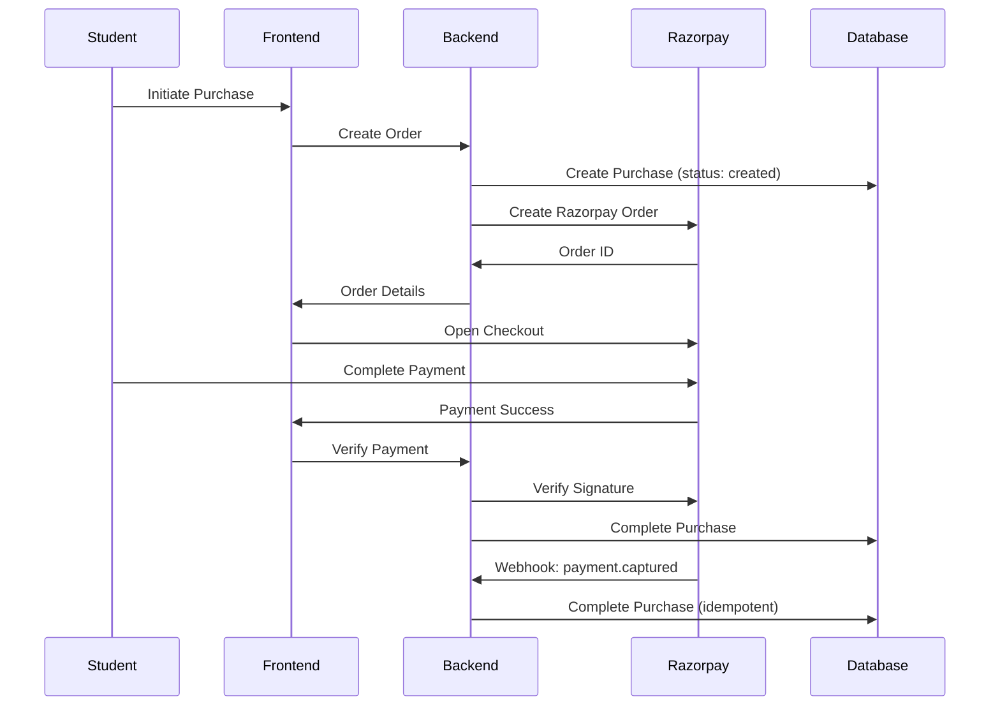

## Overview

SkillRise integrates **Razorpay** for payment processing with a robust webhook-based enrollment system. The architecture ensures reliable course enrollment even when frontend verification fails.

## Payment Architecture



<Note>
  The webhook serves as a reliable fallback mechanism, ensuring enrollment completes even if the frontend verification fails due to network issues or browser closure.
</Note>

## Purchase Model

### Purchase Schema

```javascript server/models/Purchase.js
import mongoose from 'mongoose'

const purchaseSchema = new mongoose.Schema(
  {
    courseId: { 
      type: mongoose.Schema.Types.ObjectId, 
      ref: 'Course', 
      required: true 
    },

    userId: {
      type: String,
      ref: 'User',
      required: true,
    },

    amount: { type: Number, required: true },

    currency: { type: String, default: 'INR' },

    providerOrderId: { type: String },

    providerPaymentId: { type: String },

    status: {
      type: String,
      enum: ['created', 'pending', 'completed', 'failed', 'refunded'],
      default: 'created',
    },
  },
  { timestamps: true }
)

const Purchase = mongoose.model('Purchase', purchaseSchema)
export default Purchase
```

## Purchase Status Flow

<Steps>
  <Step title="created">
    Initial state when purchase record is created before Razorpay order.
  </Step>
  <Step title="pending">
    Razorpay order created, waiting for payment completion.
  </Step>
  <Step title="completed">
    Payment verified, user enrolled in course.
  </Step>
  <Step title="failed">
    Payment failed or was cancelled by user.
  </Step>
  <Step title="refunded">
    Payment was refunded to the user.
  </Step>
</Steps>

## Razorpay Service

### Create Order

Generate a Razorpay order with purchase metadata:

```javascript server/services/payments/razorpay.service.js
import crypto from 'crypto'
import Razorpay from 'razorpay'
import Purchase from '../../models/Purchase.js'

export const createOrder = async ({ purchaseId, amount, courseTitle }) => {
  const razorpayInstance = new Razorpay({
    key_id: process.env.RAZORPAY_KEY_ID,
    key_secret: process.env.RAZORPAY_KEY_SECRET,
  })

  const currency = process.env.CURRENCY || 'INR'

  const order = await razorpayInstance.orders.create({
    amount: Math.round(amount * 100), // convert to paise
    currency,
    receipt: purchaseId.toString(),
    notes: {
      purchaseId: purchaseId.toString(),
      courseTitle,
    },
  })

  // Store the Razorpay order id on the Purchase
  await Purchase.findByIdAndUpdate(purchaseId, { 
    providerOrderId: order.id 
  })

  return {
    orderId: order.id,
    keyId: process.env.RAZORPAY_KEY_ID,
  }
}
```

<Info>
  The `purchaseId` is stored in Razorpay's `notes` field, allowing the webhook to identify which internal purchase to complete.
</Info>

### Verify Payment Signature

Verify payment authenticity using HMAC-SHA256:

```javascript server/services/payments/razorpay.service.js
export const verifyPayment = ({ orderId, paymentId, signature }) => {
  const expected = crypto
    .createHmac('sha256', process.env.RAZORPAY_KEY_SECRET)
    .update(`${orderId}|${paymentId}`)
    .digest('hex')
    
  return crypto.timingSafeEqual(
    Buffer.from(expected), 
    Buffer.from(signature)
  )
}
```

<Warning>
  Always use `crypto.timingSafeEqual()` for signature comparison to prevent timing attacks.
</Warning>

## Purchase Completion Service

### Idempotent Enrollment

The core enrollment logic is idempotent and centralized:

```javascript server/services/payments/order.service.js
import Purchase from '../../models/Purchase.js'
import User from '../../models/User.js'
import Course from '../../models/Course.js'

export const completePurchase = async (purchaseId, providerPaymentId) => {
  const purchase = await Purchase.findById(purchaseId)

  if (!purchase) {
    console.warn(`completePurchase: purchase ${purchaseId} not found`)
    return
  }

  // Idempotency guard — webhook may fire more than once
  if (purchase.status === 'completed') return

  // Enroll user in course (addToSet prevents duplicates)
  await Course.findByIdAndUpdate(purchase.courseId, {
    $addToSet: { enrolledStudents: purchase.userId },
    $inc: { totalEnrolledStudents: 1 },
  })

  await User.findByIdAndUpdate(purchase.userId, {
    $addToSet: { enrolledCourses: purchase.courseId },
  })

  purchase.status = 'completed'
  purchase.providerPaymentId = providerPaymentId
  await purchase.save()
}
```

<Tip>
  This function is the **single source of truth** for enrollment. It's called from both the frontend verification endpoint and the webhook handler.
</Tip>

<Info>
  The `$addToSet` operator ensures that calling this function multiple times won't create duplicate enrollments.
</Info>

## Webhook Handler

### Razorpay Webhook Verification

Securely handle Razorpay payment capture webhooks:

```javascript server/controllers/webhooks.js
import crypto from 'crypto'
import { completePurchase } from '../services/payments/order.service.js'

export const razorpayWebhooks = async (req, res) => {
  const signature = req.headers['x-razorpay-signature']
  // req.body is a raw Buffer here (express.raw middleware)
  const rawBody = req.body

  const expectedSignature = crypto
    .createHmac('sha256', process.env.RAZORPAY_WEBHOOK_SECRET)
    .update(rawBody)
    .digest('hex')

  if (
    !signature ||
    !crypto.timingSafeEqual(
      Buffer.from(expectedSignature), 
      Buffer.from(signature)
    )
  ) {
    return res.status(400).json({ 
      error: 'Invalid Razorpay webhook signature' 
    })
  }

  const event = JSON.parse(rawBody.toString())

  if (event.event === 'payment.captured') {
    const payment = event.payload?.payment?.entity
    // purchaseId was stored in Razorpay's `notes` field
    const purchaseId = payment?.notes?.purchaseId
    const paymentId = payment?.id

    if (purchaseId && paymentId) {
      await completePurchase(purchaseId, paymentId)
    }
  }

  res.json({ received: true })
}
```

<Steps>
  <Step title="Signature Verification">
    Verify the webhook signature using the raw body before parsing JSON.
  </Step>
  <Step title="Event Filtering">
    Only process `payment.captured` events to avoid handling incomplete payments.
  </Step>
  <Step title="Purchase ID Extraction">
    Extract the internal purchase ID from Razorpay's notes field.
  </Step>
  <Step title="Complete Enrollment">
    Call the idempotent `completePurchase` function to enroll the user.
  </Step>
</Steps>

<Warning>
  **Critical**: Verify the webhook signature on the **raw body** before parsing JSON. Parsing before verification will cause signature mismatch.
</Warning>

## Express Middleware Configuration

The webhook endpoint requires special body parsing:

```javascript server/server.js
import express from 'express'

const app = express()

// Raw body parser for Razorpay webhooks
app.use(
  '/api/webhooks/razorpay',
  express.raw({ type: 'application/json' })
)

// JSON parser for all other routes
app.use(express.json())
```

<Note>
  The raw body parser must be applied **before** the JSON parser to preserve the original request body for signature verification.
</Note>

## Environment Variables

```bash .env
RAZORPAY_KEY_ID=rzp_test_xxxxxxxxxxxxx
RAZORPAY_KEY_SECRET=xxxxxxxxxxxxxxxxxxxxx
RAZORPAY_WEBHOOK_SECRET=xxxxxxxxxxxxxxxxxxxxx
CURRENCY=INR
```

## Payment Flow States

<AccordionGroup>
  <Accordion title="Checkout Initiated">
    Purchase record created with `status: 'created'`. Razorpay order generated and checkout modal opened.
  </Accordion>
  
  <Accordion title="Payment Processing">
    User completes payment on Razorpay. Status updated to `pending` while awaiting capture.
  </Accordion>
  
  <Accordion title="Frontend Verification">
    Frontend receives payment success and calls verify endpoint. If successful, enrollment completes immediately.
  </Accordion>
  
  <Accordion title="Webhook Backup">
    Razorpay sends `payment.captured` webhook. If frontend verification failed, webhook ensures enrollment completes.
  </Accordion>
  
  <Accordion title="Enrollment Complete">
    User added to course's `enrolledStudents` array and course added to user's `enrolledCourses` array.
  </Accordion>
</AccordionGroup>

## Security Features

<CardGroup cols={2}>
  <Card title="HMAC Signature Verification" icon="shield-halved">
    All webhook requests are verified using HMAC-SHA256 signatures.
  </Card>
  <Card title="Timing-Safe Comparison" icon="clock">
    Signature comparison uses timing-safe functions to prevent timing attacks.
  </Card>
  <Card title="Idempotent Operations" icon="rotate">
    Purchase completion can be called multiple times safely without duplicate enrollments.
  </Card>
  <Card title="Raw Body Verification" icon="file-code">
    Webhook signatures are verified on raw body to prevent tampering.
  </Card>
</CardGroup>

## Error Handling

<Tabs>
  <Tab title="Payment Failed">
    If payment fails, the purchase status remains `created` or changes to `failed`. User is not enrolled.
  </Tab>
  <Tab title="Webhook Replay">
    Idempotency check prevents duplicate enrollments if webhook fires multiple times.
  </Tab>
  <Tab title="Invalid Signature">
    Returns 400 error and ignores the webhook payload to prevent unauthorized access.
  </Tab>
  <Tab title="Missing Purchase ID">
    Webhook completes successfully but enrollment is skipped if purchase ID is missing.
  </Tab>
</Tabs>

## Best Practices

<Tip>
  **Dual Verification Path**: Implement both frontend verification and webhook handling to ensure enrollment reliability.
</Tip>

<Tip>
  **Store Metadata in Notes**: Use Razorpay's `notes` field to store internal IDs that survive through their system.
</Tip>

<Tip>
  **Centralize Enrollment Logic**: Keep enrollment logic in a single idempotent function called by both verification paths.
</Tip>

## Next Steps

<CardGroup cols={3}>
  <Card title="Course Management" icon="book" href="/features/course-management">
    Understand the course structure that users purchase
  </Card>
  <Card title="Analytics" icon="chart-line" href="/features/analytics">
    Track purchase conversions and revenue
  </Card>
  <Card title="Authentication" icon="shield" href="/features/authentication">
    Secure user accounts and payment authorization
  </Card>
</CardGroup>